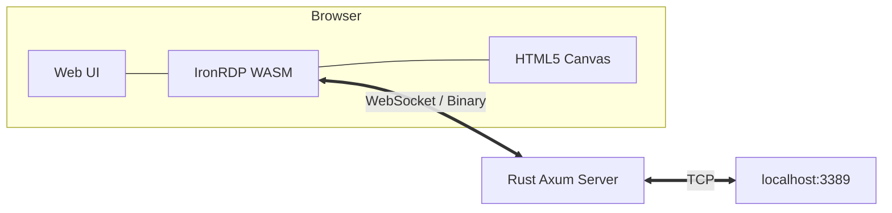

# Web RDP Rust (WASM-based Client)

A high-performance, web-native RDP client built with Rust and the [IronRDP](https://github.com/Devolutions/IronRDP) ecosystem. This project implements a lightweight agent that runs directly on target machines, providing a smooth HTML5 experience with minimal latency.

## 🚀 How It's Different

Traditional web-based RDP solutions often rely on heavy server-side proxies (like Guacamole) that decode RDP traffic, re-encode it into image streams (MJPEG/PNG), and send pixels to the browser. This introduces significant CPU overhead and latency.

**This solution is different because:**
- **In-Browser Decoding:** The entire RDP protocol state machine and graphics decoding run in the browser via WebAssembly (WASM).
- **Transparent Proxy:** The Rust server acts only as a simple WebSocket-to-TCP relay. It does zero PDU inspection or pixel re-encoding.
- **Zero-Copy Rendering:** Decoded pixels are written directly to the HTML5 Canvas using `putImageData`, achieving native-like performance.
- **Security:** Credential negotiation (NLA/CredSSP) is handled client-side using the `sspi` crate in WASM.

## 🏗 Architecture



## 📂 Project Structure

- `server/`: The backend proxy built with `Axum` and `Tokio`.
- `wasm/`: The core RDP logic using `ironrdp`. Compiles to WebAssembly.
- `web/`: The frontend UI (Vanilla JavaScript + CSS).
- `scripts/`: Automated build scripts for Windows and Ubuntu.

## 🛠 Pre-requisites

- **Rust:** Latest stable version.
- **Wasm-pack:** For building the WASM module.
  ```powershell
  cargo install wasm-pack
  ```
- **Wasm-opt:** (Optional but recommended) for optimizing WASM binary size. Usually bundled with wasm-pack.

## ⚡ Quickstart

### 1. Build the Project
Use the provided build script for your platform:

**Windows:**
```powershell
.\scripts\build-windows.ps1
```

**Ubuntu/Linux:**
```bash
./scripts/build-ubuntu.sh
```

### 2. Run the Server
The server serves both the static web files and the WebSocket proxy.

```powershell
.\target\release\server.exe --port 8080 --rdp-target localhost:3389
```

### 3. Connect
Open `http://localhost:8080` in any modern browser. Enter your credentials and enjoy a high-performance RDP session.

## 🧠 How It Works

1. **PDU Framing:** Since WebSockets are message-based but RDP is stream-oriented, we implement custom framing in `wasm/src/framed.rs` to extract TPKT (X224) and FastPath packets.
2. **Connector Sequence:** The `ironrdp-connector` state machine drives the handshake through initiation, security upgrades (TLS/CredSSP), and capability negotiation.
3. **Active Session:** Once connected, the `ActiveStage` processes incoming graphics PDUs, updating a local framebuffer which is then rendered by `canvas.rs`.
4. **Input Handling:** Keyboard and mouse events are captured in JS, converted to AT-101 scancodes, and sent to WASM to be encoded as RDP input PDUs.

## 🔍 Troubleshooting

Based on challenges faced during the initial implementation:

### Build Errors
- **File Access Denied (os error 32):** Frequently caused by Windows Defender or `rust-analyzer` locking files in the `target/` directory during high-intensity compilation (especially during `wasm-pack`). Try closing your IDE or disabling real-time scanning for the project folder.
- **WASM Memory Limit:** If the WASM module fails to load, ensure you aren't initializing multiple large framebuffers. We use a single shared buffer for the canvas.

### Runtime Issues
- **WebSocket Disconnection:** Ensure the `--rdp-target` is reachable from the server. If targeting a remote Windows machine, check firewall rule 3389.
- **Blank Screen:** Headless browser environments (like testing tools) may not render the UI correctly if using `backdrop-filter: blur()`. Verify in a physical browser.
- **Credentials/NLA:** If connection fails during the "CredSSP" state, verify that NLA is correctly configured on the target machine.

### Design Notes
- **Axum Router:** Axum 0.8+ no longer supports `nest_service` at the root path. The server uses `fallback_service` to correctly handle static assets alongside the `/ws` route.
- **Web-Sys Features:** Several DOM APIs used by the client (like `Clipboard` or `CssStyleDeclaration`) require explicit feature flags in `wasm/Cargo.toml`.
