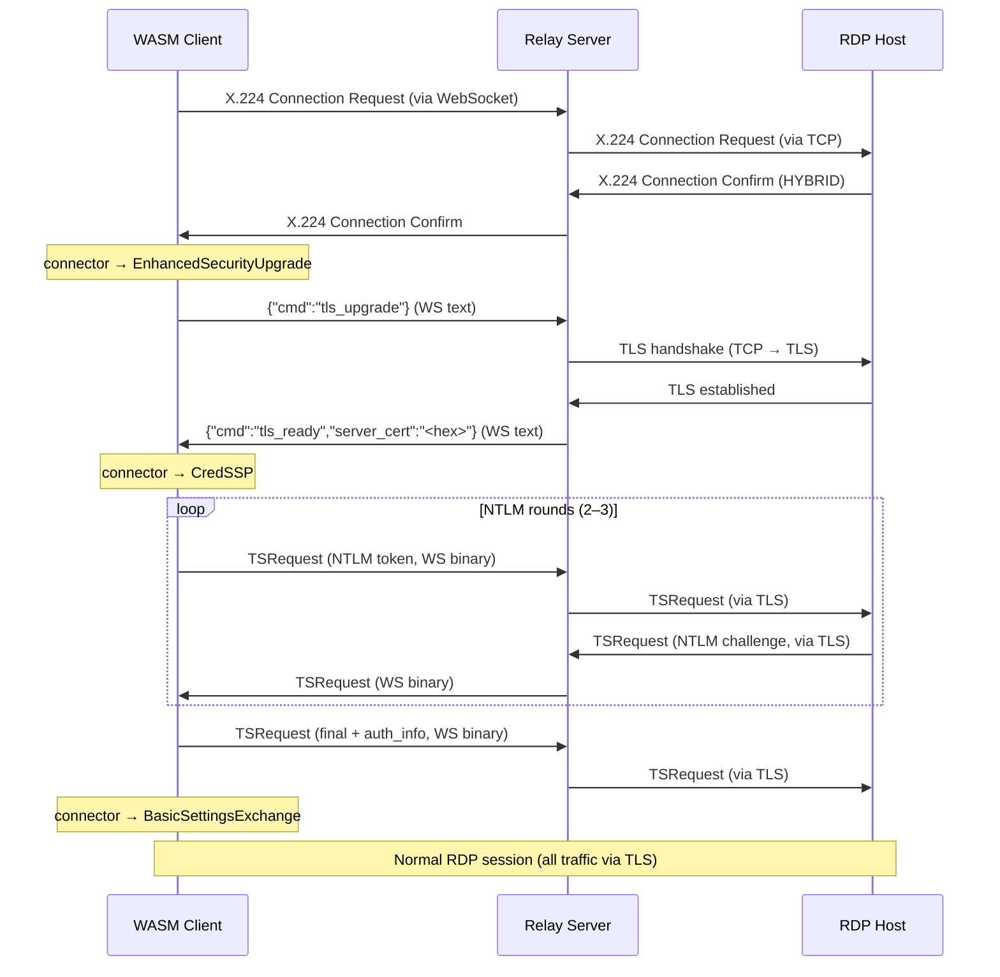

# CredSSP / NLA implementation

When the RDP host requires NLA, the connection goes through a proxy-mediated TLS upgrade before CredSSP begins. The WASM client cannot do a TLS handshake directly (browsers don't expose raw TLS), so the relay handles the handshake and passes the server certificate back.

## Sequence

If NLA is disabled on the target, the connector skips the TLS upgrade and CredSSP rounds entirely and goes straight to BasicSettingsExchange.

## Implementation notes

**Certificate extraction** — the relay extracts the DER-encoded server certificate from the TLS handshake and sends it as a hex string in the `tls_ready` message. The WASM client decodes it, extracts the raw SubjectPublicKeyInfo BIT STRING (matching FreeRDP's `i2d_PublicKey()` output), and uses it as the channel binding for CredSSP.

**NTLM only** — Kerberos is not supported. The `sspi::credssp::CredSspClient` is initialised in `ClientMode::Ntlm`. Kerberos network requests (`GeneratorState::Suspended`) are rejected.

**HYBRID_EX** — if HYBRID_EX was negotiated during X.224, the client reads the 4-byte `EarlyUserAuthResult` after the final TSRequest and requires it to be all-zero (access granted).

**SPN** — hardcoded to `TERMSRV/localhost`. The actual routing is handled by `--rdp-target` on the relay; the SPN does not need to match the real hostname because the server-side NLA validation uses the certificate binding, not the SPN, to verify the connection.
